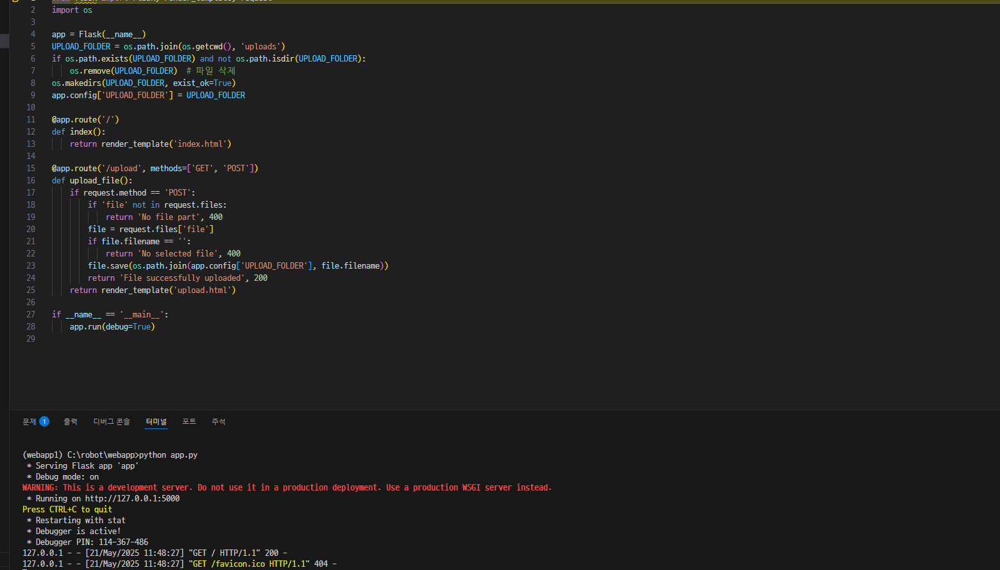
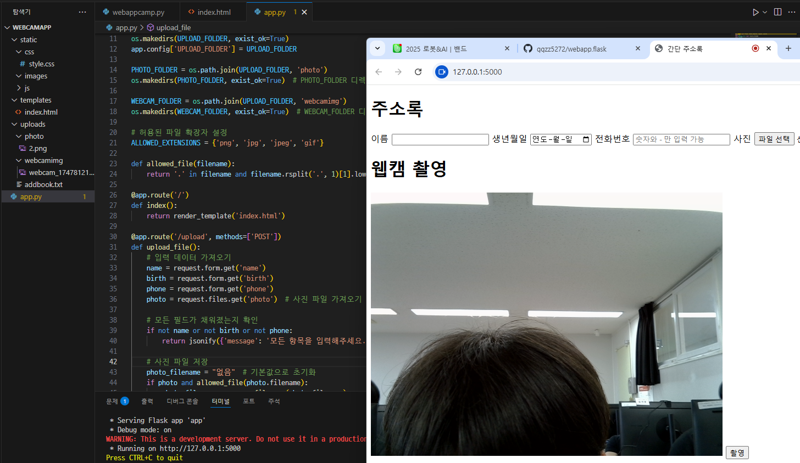

# webapp.flask
1. 새폴더 가상환경 만들기
2. vscode 가상환경들어가서 flask설치 (pip install flask)
3. app.py, index.html 생성후 코드넣기
4. 실행(python app.py)

브라우저에서 http://127.0.0.1:5000 들어가기

추가
css 파일생성, 이미지 저장

추가2
웹캠 활용 촬영 저장

